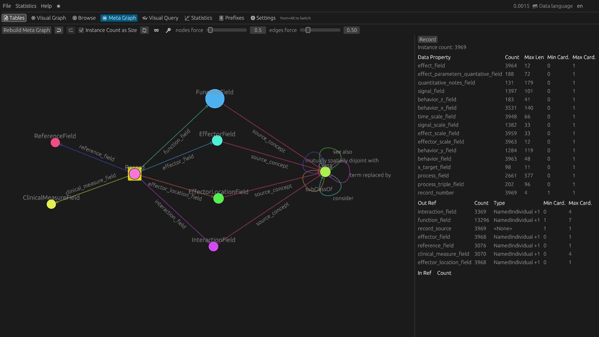

# Whole Person Physiome (WPP) draft

## WPP KG

[Click Here](https://wholepersonproject.github.io/wpp-kg/) to browse the current WPP KG.

## WPP KG in RDF Glance

[Click Here](https://xdobry.github.io/rdfglance/?url=https://wholepersonproject.github.io/wpp-kg/collection/wpp/draft/graph.ttl) to browse the [latest WPP draft](https://wholepersonproject.github.io/wpp-kg/collection/wpp/draft/) in RDF Glance. 

## Visualizations

* [WPP Temporal-Spatial Graph Visualization](./visualizations/wpp-temporal-spatial-counts.html) -- for validation
* [WPP Temporal-Spatial Graph Visualization (imperfectly cleaned)](./visualizations/wpp-temporal-spatial-counts--cleaned.html) -- closer to original, but flawed cleaning

## Reports

[REPORTS.md](https://github.com/wholepersonproject/wpp-data-products/blob/gh-pages/REPORTS.md) includes a report of all the reports generated as part of the HRAlit generation process. It shows the SPARQL queries used, output, and associated documentation.
